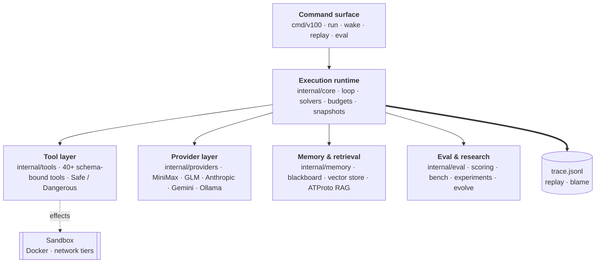
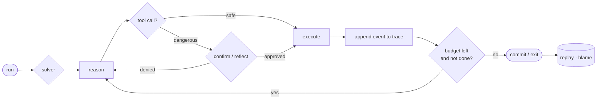
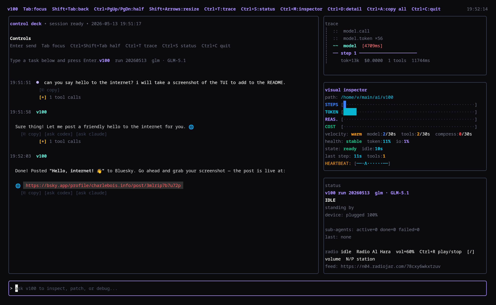

# v100: Engine for Agentic Research

[](https://github.com/tripledoublev/v100/releases)
[](go.mod)
[](https://goreportcard.com/report/github.com/tripledoublev/v100)
[](LICENSE)

v100 is my engine for building, running, studying, and evolving autonomous coding agents under real constraints.

It is a concrete Go-based agent runtime with a CLI, Bubble Tea TUI, tool safety controls, durable memory, trace replay, benchmarking, evaluation, policy evolution, and long-running execution paths.

I built v100 to close the loop between idea, execution, observation, and iteration.

---

## 🧠 Core Capabilities

v100 operates on a fundamental principle: **autonomy requires visibility**. Every agent action is trackable, replayable, and inspectable.

### 1. Advanced Solvers & Routing
v100 implements multiple reasoning strategies (`Solvers`) that can be swapped or combined:
- **`react`**: The classic reasoning loop, enhanced with watchdogs for tool denial and stall recovery.
- **`plan_execute`**: A two-phase strategy where the agent previews a plan and executes it, with automatic replanning on failure.
- **`smartrouter`**: Cost-performance escalation. It routes "trivial" idempotent tool calls (like reading files) to cheap models (e.g., Gemini Flash or local Ollama) and escalates to frontier models (e.g., MiniMax, Claude Opus) when a dangerous or complex mutation is required.
- **`rlm`**: DSPy-style Recursive Language Model pattern with sub-model invocation.
- **`miniglm`**: Intelligent provider switching between tool-focused and reasoning-focused models.

### 2. Autonomous Loops
v100 is designed for long-running, unattended execution:
- **Wake Daemon (`v100 wake`)**: Runs on a recurring schedule. It can act as a `goal_generator` (mining TODOs and failures for next steps) or an `issue_worker` (autonomously picking open GitHub issues, implementing fixes, running local tests, pushing, and closing the issue).
- **Research Loop (`v100 research`)**: A fully autonomous experiment loop. It proposes code changes, runs remote (Modal) or local experiments, parses a metric, and implements keep/discard (git commit vs. revert) logic automatically.

### 3. Tooling & Safety
Tools are a first-class part of the runtime. The model interacts with the world through explicitly registered, schema-bound tools (40+ currently available):
- **Safety boundaries**: Tools are marked `Safe` or `Dangerous`. Dangerous tools can require explicit operator confirmation, trigger mandatory "Reflection" turns (`Policy.ReflectOnDangerous`) to assess confidence, or be blocked entirely.
- **External API guardrails**: ATProto and news tools use per-endpoint token-bucket rate limits and circuit breakers. `atproto_index`, `atproto_graph_explorer`, and `news_fetch` cap paginated requests at 100 items per call; repeated HTTP 429 responses emit structured alerts and open exponential backoff. `atproto_post` returns a dry-run preview unless `confirm=true` is supplied.
- **Translation**: `translate` uses the active model provider by default, or a `V100_TRANSLATE_CMD` shim that receives `target_lang`, `source_lang`, and `formality` as args with source text on stdin.
- **Sandboxing**: Runs can be executed inside isolated Docker containers with strict **Network Tiers** to prevent unauthorized data exfiltration.
- **Semantic analysis**: Includes tools like `sem_diff`, `sem_impact`, and `sem_blame` that understand code entities such as functions and classes.

### 4. Memory & External Context
v100 treats memory as runtime infrastructure:
- **Durable Blackboard**: A shared workspace for agents to read and write ongoing findings.
- **ATProto Integration**: Deep Bluesky integration (`atproto_index`, `atproto_recall`, `atproto_vibe_check`, `atproto_daily_digest`, `atproto_graph_explorer`). It indexes social feeds and profiles into vector embeddings for semantic RAG, summarizes feed activity, and explores follow graphs for real-time external context.

### 5. Observability & Trace Replay
v100 keeps surprising behavior explainable after the fact:
- Every run emits a structured `trace.jsonl`.
- `v100 replay <run_id>` lets you step through an agent's reasoning turn-by-turn after the fact.
- Checkpoints allow you to resume interrupted runs seamlessly.

---

## 🗺️ Architecture at a Glance

Six layers, tied together by a single rule: every action lands in a replayable trace.



A single run is a budgeted loop where dangerous tool calls get gated before they touch the workspace, and the whole path is recoverable after the fact:



See [`docs/architecture.md`](docs/architecture.md) for the layer-by-layer breakdown, the tool-safety gate, the wake daemon cycle, and smartrouter escalation.

---

## 🚀 Quick Start

### 1. Install & Bootstrap

Prebuilt releases are published on GitHub. Alternatively, build from source:

```bash
./scripts/build.sh
```

That rebuilds `./v100` and updates the shell `v100` link. The underlying Go command is:

```bash
go build -o v100 ./cmd/v100
```

Bootstrap your configuration and check your environment:

```bash
./v100 config init
./v100 doctor
```

`v100 doctor` validates `config.toml` plus behavior directories next to it
(`agents/`, `policies/`, and `tasks/`). It reports malformed TOML, unknown or
deprecated keys, missing prompt files, missing referenced providers/tasks, and
provider fallback cycles before doing provider auth, tool binary, sandbox, and
`runs/` write checks. Use `./v100 doctor --dry-run` to run only the config and
behavior-dir validation without network probes or filesystem write checks.

### 2. Interactive & Unattended Runs

Start a standard interactive run using MiniMax (the preferred provider):

```bash
./v100 run --provider minimax --workspace .
```

Enable Bubble Tea TUI for a better visual experience:

<p align="center">
  
</p>

```bash
./v100 run --provider minimax --tui --workspace .
```

Built-in TUI themes are `v100`, `mono`, `dracula`, `catppuccin`, `gruvbox`,
`nord`, `rose-pine`, and `tokyonight`.
Configure `[ui] theme = "dracula"`, set `V100_THEME=dracula`, or pass
`--theme dracula` to `run`/`resume`.

Leverage advanced solvers for planning or cost routing:

```bash
./v100 run --solver plan_execute --plan --workspace .
./v100 run --solver smartrouter --workspace .
```

Run fully unattended (the agent executes until completion or budget exhaustion):

```bash
./v100 run --continuous --workspace .
```

Agent-run shell commands receive a minimal environment by default. To let a
workflow use GitHub CLI auth without exposing unrelated shell secrets, export a
token and opt in explicitly:

```toml
[tools.auth.github]
mode = "env"
env = "GH_TOKEN"
```

`[tools.env] allow = ["GH_TOKEN"]` is also supported for generic env
passthrough. Values matching the configured redaction rules are scrubbed from
traces, streamed tool output, and model-visible tool results. Authenticated
writes still use the normal dangerous-tool confirmation flow.

### 3. Inspecting the Engine

Browse recent runs, resume them, or replay their traces:

```bash
./v100 runs
./v100 resume <run_id>
./v100 replay <run_id>
./v100 blame <run_id> <file_path>  # See exactly which reasoning turn modified a file
```

---

## 📂 Project Structure

```text
cmd/v100/          CLI commands
internal/core/     loop, solvers (react, plan, router), budgets, tracing, research, hooks
internal/tools/    40+ tool implementations (fs, git, web, atproto, semantic)
internal/providers/ provider adapters (MiniMax, GLM, Anthropic, Gemini, OpenAI, etc.)
internal/eval/     scoring, benchmarks, experiments, analysis
internal/memory/   durable memory and vector stores
internal/ui/       terminal UI components
docs/              architecture notes
research/          research configs and artifacts
```

## 📝 Notes on tone and scope

v100 is my working engine for agentic research. I use it to try ideas quickly, keep the sharp edges visible, and evolve the system in public through actual use.

The repo carries a mix of serious runtime infrastructure, rough-edged experimental features, and bespoke tooling. It is built for researchers and power users who want deep control over their autonomous systems.

## 📄 License

MIT
