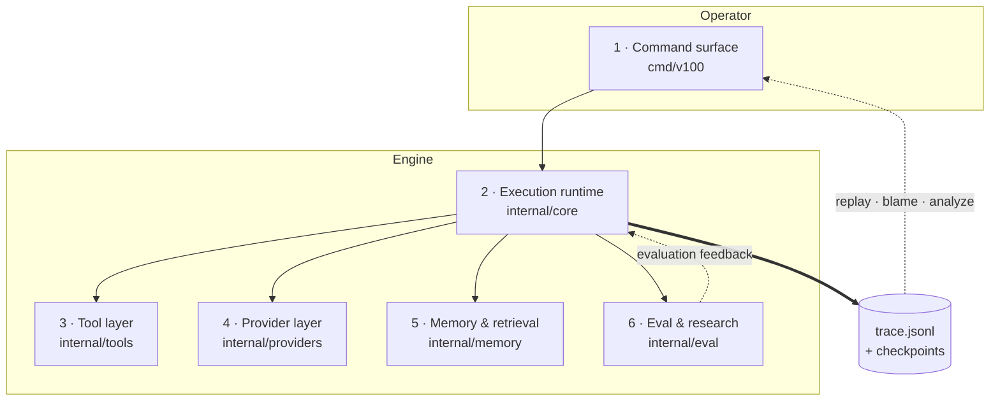
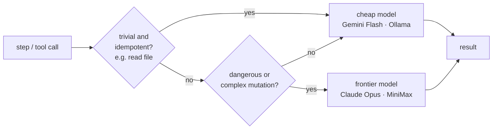
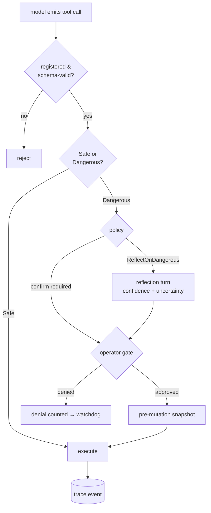
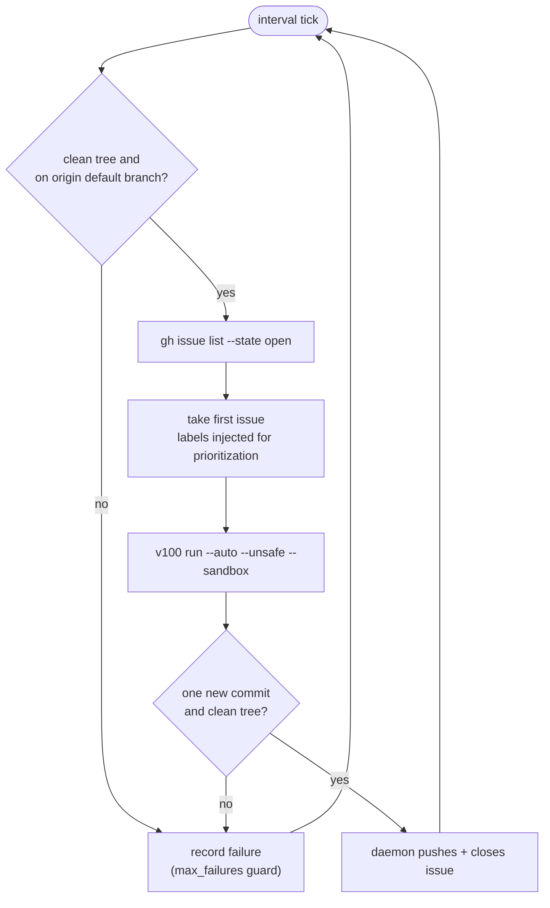

# v100 Architecture

This document describes v100 the way I actually use it: as an engine for agentic research.

The important framing is simple:

- v100 is a runtime for building, executing, inspecting, and evolving autonomous agents

Research is one subsystem inside that runtime.

## System view

The system has six main layers:

1. the command surface
2. the execution runtime
3. the tool layer
4. the model/provider layer
5. the memory and retrieval layer
6. the evaluation and research layer

Those layers are tied together by traceability, checkpoints, and a bias toward inspectable behavior over hidden magic.

The dashed edges are what make it a loop rather than a pipeline: evaluation feeds back into the runtime, and every run leaves a trace the operator can replay.

## 1. Command surface

Path: `cmd/v100/`

This is the operator-facing entry point.

The command surface is broad because v100 is meant to support the whole lifecycle of agent work, not just one run mode. In practice, the commands break down into a few clusters:

- run control: `run`, `resume`, `replay`, `runs`, `restore`, `compress`
- operator/runtime support: `doctor`, `tools`, `providers`, `agents`, `update`, `install`, `login`, `logout`
- memory and inspection: `memory`, `blame`, `diff`
- eval and benchmarking: `score`, `stats`, `metrics`, `analyze`, `eval`, `verify`, `bench`, `experiment`
- autonomous loops: `wake`, `research`, `evolve`

This layer should be thought of as the shell around the engine. It decides how a run starts, what configuration is applied, how the operator interacts with it, and how results are revisited later.

## 2. Execution runtime

Path: `internal/core/`

This is the center of the system.

The runtime is responsible for:

- maintaining the agent loop
- selecting and driving solver behavior
- managing budgets
- tracking event history
- checkpointing and restoring state
- handling workspace and sandbox concerns
- supporting long-running or resumed execution

Important pieces:

- `loop.go`: the main reasoning and tool-execution loop. Also contains the **Hook system** (`PolicyHook`, `HookStage`, `HookResult`) which handles critical flow-control interventions (`PressureMonitor`, `RecoveryHook`).
- `solver*.go`: The `Solver` interface returning `SolveResult`, and its implementations:
  - `ReactSolver`: Classic reasoning loop (includes watchdogs and tool denial counting).
  - `PlanExecuteSolver`: Two-phase plan-then-execute strategy.
  - `RouterSolver`: Cheap-to-smart provider escalation (using a `trivialMutations` allowlist for cheap tool execution).
  - `RLMSolver`: DSPy-style Recursive Language Model pattern with sub-model invocation.
  - `MiniGLMSolver`: Intelligent provider switching between tool-focused (MiniMax) and reasoning-focused (GLM) models.

The `RouterSolver` (smartrouter) is the clearest example of cost-performance routing: cheap, idempotent work stays on cheap models; anything dangerous or complex escalates to a frontier model.

- `trace.go`: structured event output for replay and analysis
- `budget.go`: Budget tracking system for token/cost accounting, limits, and `ErrBudgetExceeded` handling.
- `checkpoint*.go` and `snapshot*.go`: Persistence API (`PersistCheckpoint`, `ReadCheckpoint`, etc.) and `SnapshotManager` for workspace snapshots and restore points.
- `workspace_*.go`: applying, mapping, and filtering workspace state
- `research*.go`: research orchestration

Conceptually, this layer answers: "What should the agent do next, under what constraints, with what record of what happened?"

## 3. Tool layer

Path: `internal/tools/`

Tools are the action surface of the engine.

The model does not interact with the world directly. It interacts through tools with explicit schemas, explicit safety classifications, and explicit effects.

That matters because the project is trying to study and improve agent behavior under real conditions. If tool use is opaque, the engine becomes harder to trust and harder to debug.

The tool layer includes:

- filesystem and shell operations
- patching and git operations
- network and fetch utilities
- semantic and inspection tools
- orchestration and multi-agent tools
- external-context tools such as ATProto support
- reflection and meta-tools

Important design ideas:

- tools are registered centrally
- tools expose machine-readable input/output schemas
- tools are marked safe or dangerous
- dangerous tools can require confirmation or extra runtime handling
- tool effects are visible in traces and can be reviewed after the fact

This layer is one of the strongest defining traits of v100. The project is not only about model quality; it is about runtime behavior at the boundary between model and environment.

The Safe/Dangerous classification is enforced at the boundary, before any effect reaches the workspace:

## 4. Provider layer

Path: `internal/providers/`

Providers give the runtime a uniform interface over multiple model backends.

This layer exists so the rest of the system can reason in terms of:

- completion
- streaming
- metadata
- retry behavior
- routing

without hardcoding one vendor everywhere.

Current provider support includes hosted APIs, subscription-style access paths, and local backends. Just as important, v100 separates the chat/runtime provider path from the embedding path where needed, which keeps retrieval features from being tightly coupled to one model choice.

This layer is about optionality and operational realism. In actual agent work, provider availability, latency, price, and failure modes matter.

## 5. Memory and retrieval

Paths:

- `internal/memory/`
- parts of `internal/tools/`

v100 treats memory as runtime infrastructure, not just prompt stuffing.

There are two broad categories here:

- durable structured memory tied to the workspace and operator context
- vector-backed retrieval for semantically relevant context

This allows the engine to keep and reuse information across runs instead of treating each run as a sealed one-shot interaction.

Recent ATProto work fits here. It is not "social tooling for its own sake"; it is another retrieval surface the engine can index and query when outside context is useful to the run.

This layer matters because useful agentic systems need recall, not just immediate reasoning.

## 6. Evaluation, benchmarking, and research

Paths:

- `internal/eval/`
- parts of `internal/core/`

This layer is where v100 turns runs into feedback.

It includes:

- run scoring
- metrics extraction
- comparison and divergence analysis
- trace distillation
- benchmark execution
- experiment scaffolding
- policy mutation and evolution
- autonomous research loops

This is where "agentic research" becomes concrete. The engine does not just produce actions. It produces artifacts that can be measured, compared, replayed, distilled, and used to change the next run.

The `research` subsystem belongs here. It is important, but it sits alongside evaluation and evolution rather than above the rest of the architecture.

## Cross-cutting properties

These show up across multiple layers and are part of what makes v100 feel like one system instead of a pile of commands.

### Observability

Runs emit structured traces that can be replayed, analyzed, and compared later.

This is critical. If an agent does something surprising, I want to inspect the path it took, not just the final output.

### Safety and operator control

Tool risk is modeled directly. Confirmation, dangerous-tool handling, workspace controls, and sandbox support are not afterthoughts. This includes:
- **Sandbox network tiers:** Network access control mechanisms (`network_tier`) and sandbox gates.
- **Dangerous Tool Reflection:** Optional reflection turns (`Policy.ReflectOnDangerous`) with confidence and uncertainty scoring before executing high-risk tools.
- **Sandbox Snapshots:** Events for sandbox state capture and restoration (`EventSandboxSnapshot`, `EventSandboxRestore`).

The project is aiming for autonomy with visibility, not autonomy by hiding the sharp edges.

This is most visible in the `wake` issue-worker daemon. There is no PR step and no built-in human-approval gate; the worker prompt requires local verification before commit, and the daemon then enforces budgets, a clean-tree/default-branch preflight, and a one-commit clean-tree check before pushing:

### Long-run usability

Continuous execution, resume flows, compression, checkpoints, and wake cycles all point in the same direction: the system should be able to run longer and with less babysitting, without turning into an uninspectable black box.

### Self-improvement

Benchmarks, eval, mutation, and research loops exist because I want the engine to support iterative improvement of both prompts and runtime behavior.

## Where research fits

`v100 research` is the part of the system that runs autonomous experiment loops against a target plus an experiment command.

It is useful when I want:

- repeated agent-driven edits
- experiment execution under a defined metric
- keep/discard style iteration
- remote or cloud-backed execution hooks

But the broader architecture is intentionally larger than that. The engine is meant to support interactive work, post-run analysis, memory, eval, benchmarking, and policy evolution with or without the research loop.

## Practical reading order

If you want to understand the codebase quickly, read in this order:

1. `cmd/v100/main.go`
2. `cmd/v100/cmd_run.go`
3. `internal/core/loop.go`
4. `internal/core/solver.go` and implementations
5. `internal/tools/registry.go`
6. `internal/providers/registry.go`
7. `internal/eval/`
8. `internal/core/research*.go` if you specifically care about the research subsystem

That path gives the shortest route from "how do I start the engine?" to "how does the runtime actually behave?"

## Architecture in one sentence

v100 is an inspectable, tool-aware, multi-provider agent runtime built to support agentic research through execution, memory, evaluation, and iterative improvement.
